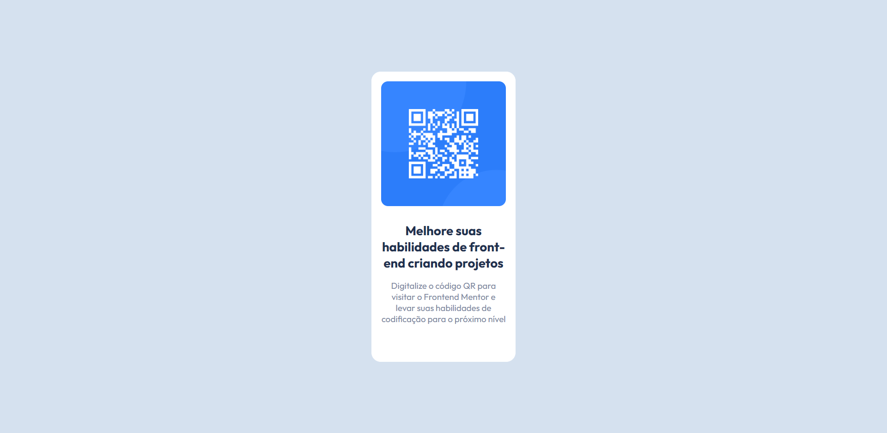

# 🧠 Desafio QR-Code Frontend Mentor

[Acesse](https://prdsilva80.github.io/qr-code/)

---

## 🛠️ Tecnologias

  

---

## 👨‍🎓 O que aprendi

- Primeiro desafio feito sem ajuda
- Apliquei tudo o que estudei até aqui
- Baixar a imagem do Figma e pposiciona-la
- Pensar em como deixar a aplicação responsiva

---

## 📧 Contato

<a href = "mailto:probertos717@gmail.com">

---

## 🔗 [Frontend Mentor](https://www.frontendmentor.io/)

---